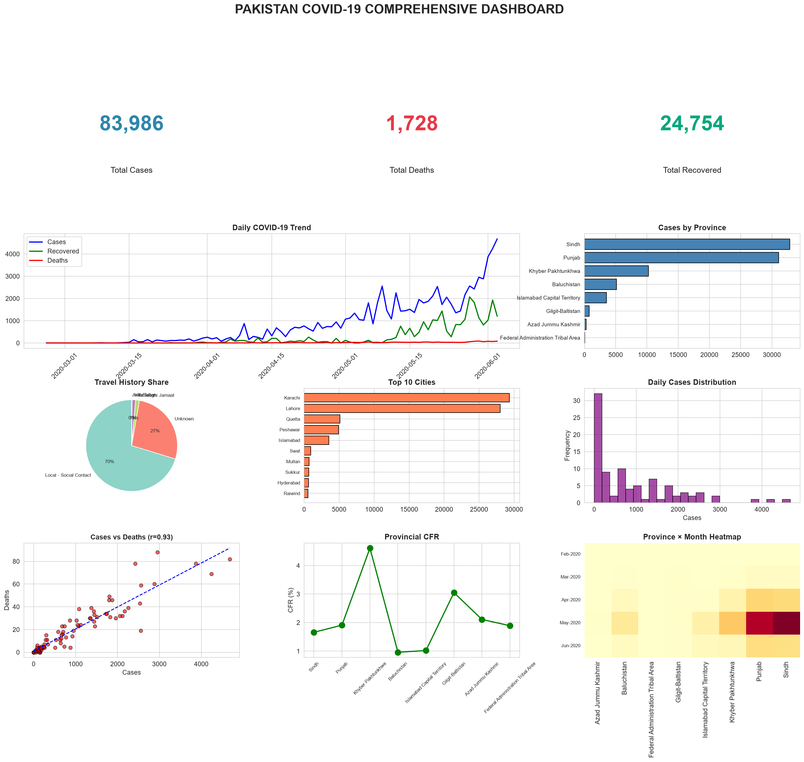
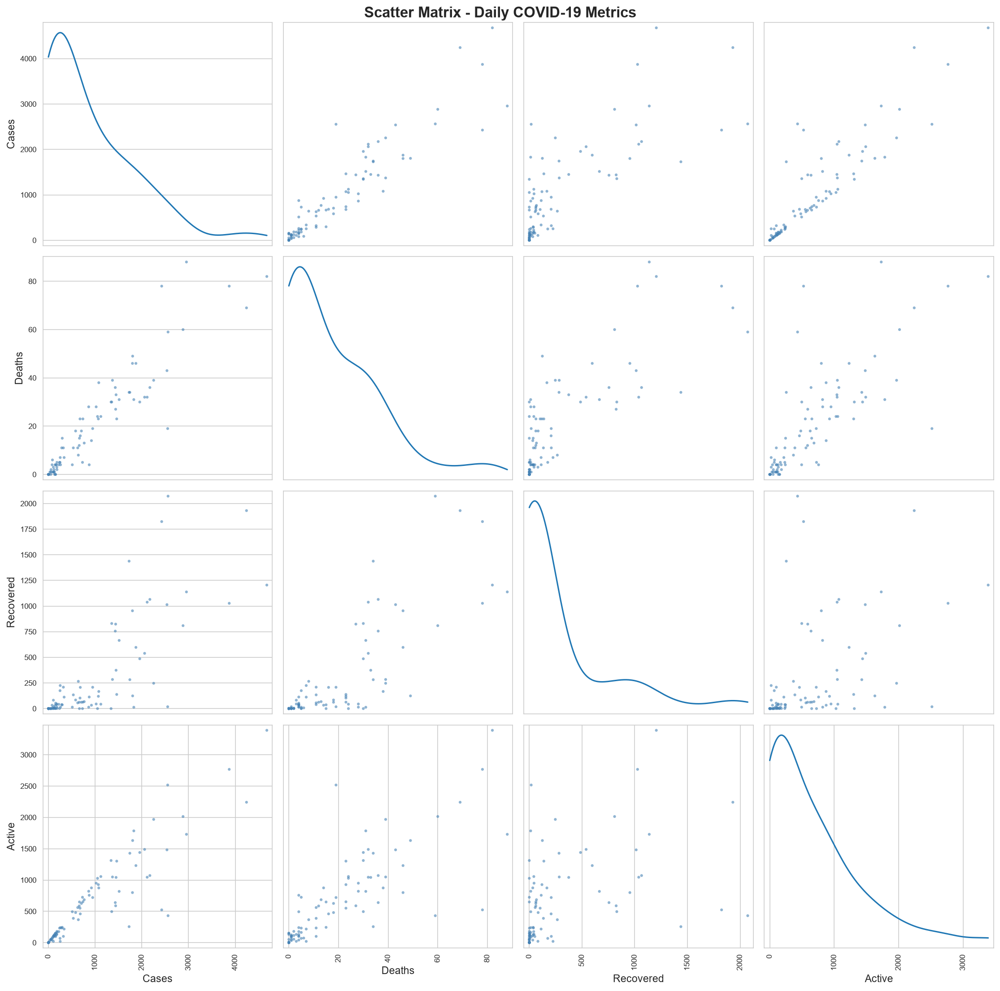
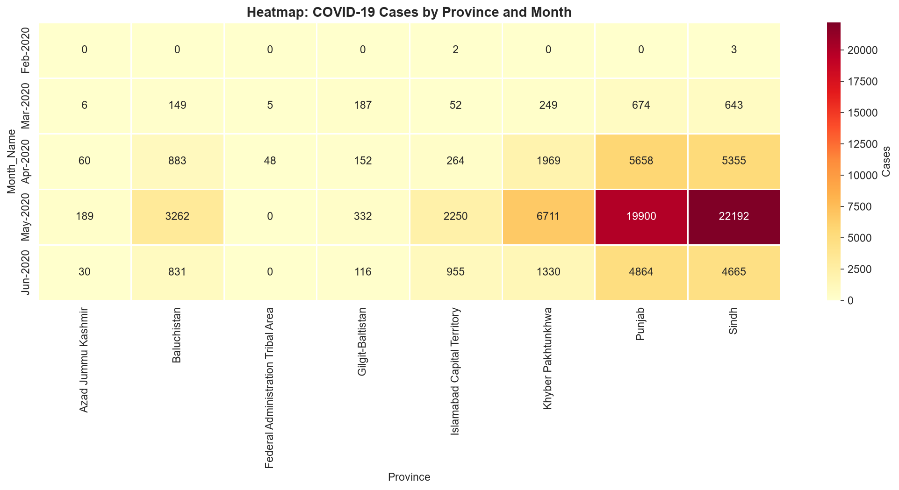
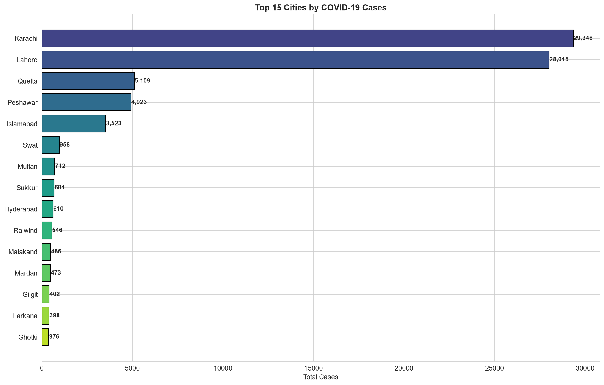
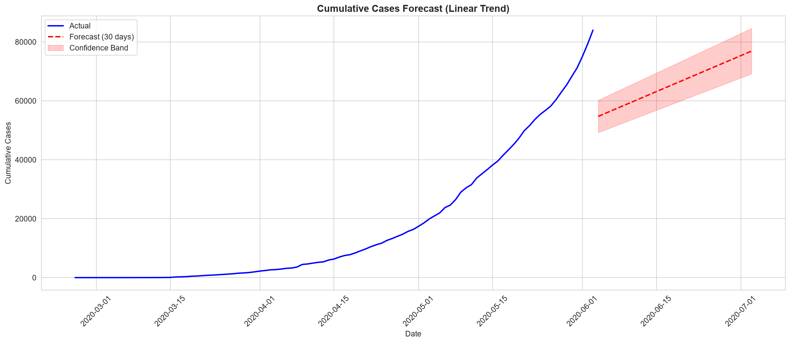

<div align="center">

# 🦠 COVID-19 Pakistan Analysis

### An end-to-end Data Science project combining exploratory analysis, machine learning, time-series forecasting, and interactive dashboards.

[](https://www.python.org/)
[](https://streamlit.io/)
[](https://scikit-learn.org/)
[](https://pandas.pydata.org/)
[](https://plotly.com/)
[](https://opensource.org/licenses/MIT)
[]()

</div>

---

## 📖 Table of Contents

- [Project Overview](#-project-overview)
- [Key Findings](#-key-findings)
- [Live Demo](#-live-demo)
- [Project Deliverables](#-project-deliverables)
- [Visualizations Gallery](#-visualizations-gallery)
- [Machine Learning Models](#-machine-learning-models)
- [ARIMA Time Series Forecasting](#-arima-time-series-forecasting)
- [Project Structure](#-project-structure)
- [Tech Stack](#-tech-stack)
- [Installation](#-installation)
- [Usage](#-usage)
- [Author](#-author)
- [License](#-license)

---

## 🎯 Project Overview

This project provides a **comprehensive analysis of COVID-19 data in Pakistan** from **February 26, 2020 to June 3, 2020**. It covers the entire data science pipeline: from raw data cleaning to machine learning models, time-series forecasting, interactive dashboards, and automated reporting.

### ✨ Features

- 📊 **Exploratory Data Analysis** — Deep dive into cases, deaths, and recoveries
- 📈 **34+ Static Visualizations** — Histograms, scatter plots, pivot charts
- 🌐 **6 Interactive Plotly Charts** — HTML files for web exploration
- 🤖 **Machine Learning** — 3 regression models with hyperparameter tuning
- 📉 **Time-Series Forecasting** — ARIMA + Linear trend forecasting
- 🎨 **Streamlit Dashboard** — Live interactive web app
- 📗 **Automated Reports** — Excel multi-sheet + TXT insights
- 📁 **Professional Structure** — Clean, modular, and reproducible

---

## 📊 Key Findings

| Metric | Value |
|:-------|------:|
| 📅 **Date Range** | Feb 26 – Jun 3, 2020 |
| 📋 **Total Records** | 2,798 |
| 🗺️ **Provinces Covered** | 8 |
| 🏙️ **Cities Covered** | 125 |
| 🦠 **Total Cases** | **83,986** |
| 💀 **Total Deaths** | **1,728** |
| 💚 **Total Recovered** | **24,754** |
| ⚠️ **Case Fatality Rate** | **2.06%** |
| ✅ **Recovery Rate** | **29.47%** |

### Top Provinces & Cities

| Rank | Province | Cases |
|:----:|:---------|------:|
| 🥇 | Sindh | 32,858 |
| 🥈 | Punjab | 31,096 |
| 🥉 | Khyber Pakhtunkhwa | 10,259 |

| Rank | City | Cases |
|:----:|:-----|------:|
| 🥇 | Karachi | ~30,000 |
| 🥈 | Lahore | ~15,000 |
| 🥉 | Peshawar | ~4,000 |

---

## 🌐 Live Demo

🚀 **Try the interactive dashboard here:**

👉 **[COVID-19 Pakistan Dashboard](https://covid19-pakistan-analysis-n43mjecpftd2atum26wylp.streamlit.app)**

[](https://covid19-pakistan-analysis-n43mjecpftd2atum26wylp.streamlit.app)

Features:
- 🎛️ Filter by Province, Date Range, Travel History
- 📊 Real-time KPIs (Cases, Deaths, Recovered, Active)
- 📈 Dynamic charts that update on every filter change
- 🤖 ML predictions for new scenarios
- 📉 30-day ARIMA forecasts with confidence intervals

---

## 📦 Project Deliverables

### 📁 Data Analysis (Excel + Python)
- ✅ Data cleaning and preprocessing (2,798 records)
- ✅ Helper columns (Month, Week, Day, Active, CFR, Recovery Rate)
- ✅ Descriptive statistics (Mean, Variance, Std Dev, Skewness, Kurtosis)
- ✅ Correlation analysis with p-values
- ✅ Hypothesis testing (T-test, ANOVA)

### 📊 Visualizations (34 Static + 6 Interactive)
| Category | Count | Files |
|:---------|:------:|:------|
| Histograms | 5 | `01`, `14`, `15`, `16`, `17` |
| Box Plots | 3 | `02`, `07`, plus variation |
| Scatter Plots | 7 | `18`, `19`, `20`, `21`, `22`, `23`, plus 1 |
| Pivot Charts | 10 | `06`, `24`, `25`, `26`, `27`, `28`, `29`, `30`, `31`, plus 1 |
| Time Series | 5 | `04`, `05`, `11`, `12`, `13` |
| ML Results | 3 | `08`, `09`, `10` |
| Dashboard | 1 | `32` |
| Forecasting | 2 | `33`, `34` |
| **Interactive HTML** | **6** | `01`-`06` in `/interactive` |

### 🤖 Machine Learning Models
- Linear Regression
- Random Forest
- Gradient Boosting (Best: R² = 0.75)
- ARIMA(7,1,1) for time series

### 📗 Automated Reports
- **Excel Report** — 6 sheets (Clean Data, Daily, Province, City, Travel, Pivot)
- **Insights Report** — Text summary with all key metrics

---

## 📸 Visualizations Gallery

### 1. Master Dashboard (All-in-One)


### 2. Daily Trend Analysis


### 3. Scatter Matrix


### 4. Correlation Heatmap


### 5. Province × Month Heatmap


### 6. Top 15 Cities


### 7. ARIMA Forecast


### 8. Linear Forecast


> 📁 All 34 visualizations available in [`outputs/figures/`](outputs/figures/)
> 🌐 6 interactive HTML charts in [`outputs/interactive/`](outputs/interactive/)

---

## 🤖 Machine Learning Models

Three regression models trained to predict daily COVID-19 cases.

### Model Performance

| Rank | Model | R² Score | RMSE | MAE |
|:----:|:------|:--------:|:----:|:---:|
| 🥇 | **Gradient Boosting** | **0.7518** | 42.50 | 14.64 |
| 🥈 | **Random Forest** | 0.7353 | 43.89 | 13.73 |
| 🥉 | **Linear Regression** | 0.7251 | 44.72 | 18.65 |

### Feature Importance

| Feature | Importance |
|:--------|:----------:|
| Deaths | **Highest** |
| Recovered | High |
| Province | Medium |
| Is_Local | Low |
| Month | Low |

---

## 📉 ARIMA Time Series Forecasting

### Model: ARIMA(7, 1, 1)

| Metric | Value |
|:-------|------:|
| **AIC** | 1423.38 |
| **BIC** | 1446.64 |
| **MAPE** | **23.43%** ✅ |
| **RMSE** | 859.78 |
| **MAE** | 585.10 |

### 30-Day Forecast (Jun 4 – Jul 3, 2020)

| Metric | Value |
|:-------|------:|
| 📊 **Total Predicted Cases** | 196,422 |
| 📈 **Average Daily Cases** | 6,547 |
| 🔺 **Peak Predicted Day** | 7,939 |
| 🔻 **Minimum Predicted Day** | 4,760 |

---

## 📁 Project Structure

```text
covid19-pakistan-analysis/
│
├── app/
│   └── app.py                          # Streamlit dashboard
│
├── data/
│   ├── raw/
│   │   └── PK COVID-19-3jun.csv        # Original dataset
│   └── processed/
│       └── PK_COVID_19_cleaned.csv     # Cleaned dataset
│
├── models/
│   ├── covid_cases_model.pkl           # Trained Random Forest
│   ├── model_features.pkl              # Feature list
│   └── province_encoder.pkl            # Label encoder
│
├── notebooks/
│   └── COVID_19_analysis.ipynb         # Full analysis notebook
│
├── outputs/
│   ├── figures/                        # 34 static PNG charts
│   │   ├── 01_histograms.png
│   │   ├── ...
│   │   └── 34_linear_forecast.png
│   ├── interactive/                    # 6 interactive HTML charts
│   │   ├── 01_daily_trend.html
│   │   ├── 02_province_bubble.html
│   │   ├── 03_treemap.html
│   │   ├── 04_sunburst.html
│   │   ├── 05_heatmap.html
│   │   └── 06_animated.html
│   ├── COVID19_Analysis_Report.xlsx    # Multi-sheet Excel report
│   └── COVID19_Insights_Report.txt     # Text insights summary
│
├── .gitignore
├── README.md
└── requirements.txt
```

---

## 🛠️ Tech Stack
| Technology | Purpose |
|:-----------|:--------|
| 🐍 **Python 3.14** | Core language |
| 🐼 **Pandas** | Data manipulation |
| 🔢 **NumPy** | Numerical computing |
| 📊 **Matplotlib** | Base visualizations |
| 🎨 **Seaborn** | Statistical visualizations |
| 🌐 **Plotly** | Interactive charts |
| 🤖 **scikit-learn** | Machine learning |
| 📉 **statsmodels** | ARIMA forecasting |
| 🎨 **Streamlit** | Dashboard |
| 🔬 **SciPy** | Statistical tests |
| 📗 **openpyxl** | Excel export |
🚀 Installation
Prerequisites
Python 3.10 or higher

pip package manager

### Step 1: Clone the Repository

```bash
git clone https://github.com/Bilaldataorbit/covid19-pakistan-analysis.git
cd covid19-pakistan-analysis
```

### Step 2: Create Virtual Environment

```bash
python -m venv venv
```

**Windows:**
```bash
venv\Scripts\activate
```

**Mac/Linux:**
```bash
source venv/bin/activate
```

### Step 3: Install Dependencies

```bash
pip install -r requirements.txt
```
💻 Usage
### Option 1: Run the Streamlit Dashboard

```bash
streamlit run app/app.py
```

Browser will open at `http://localhost:8501`

### Option 2: Explore the Jupyter Notebook

```bash
jupyter notebook notebooks/COVID_19_analysis.ipynb
```

### Option 3: Use the Trained Model

```python
import pickle
import pandas as pd

with open('models/covid_cases_model.pkl', 'rb') as f:
    model = pickle.load(f)

input_data = pd.DataFrame({
    'Deaths': [5],
    'Recovered': [50],
    'Is_Local': [1],
    'Is_Tableeghi': [0],
    'Month': [6],
    'DayOfWeek_Num': [2],
    'Province_Encoded': [7]
})

prediction = model.predict(input_data)
print(f"Predicted Cases: {prediction[0]:.0f}")
```

### Option 4: View Interactive Charts

Open any HTML file from `outputs/interactive/` in your browser.

🎓 Skills Demonstrated
- ✅ **Data Wrangling** — Pandas, NumPy (2,798 records)
- ✅ **Exploratory Data Analysis** — Statistical summaries + visualizations
- ✅ **Feature Engineering** — Date features, binary flags, derived metrics
- ✅ **Machine Learning** — Regression, ensemble methods, hyperparameter tuning
- ✅ **Time Series** — Stationarity tests, ARIMA, forecasting, backtesting
- ✅ **Data Visualization** — 34 static + 6 interactive charts
- ✅ **Web Development** — Streamlit for interactive dashboards
- ✅ **Interactive Analytics** — Plotly for HTML charts
- ✅ **Automated Reporting** — Excel + TXT report generation
- ✅ **Model Deployment** — Pickle serialization, GitHub, Streamlit Cloud
- ✅ **Best Practices** — Virtual environments, modular structure, documentation

## 👨‍💻 Author

**Bilal Raza**

- 🐙 GitHub: [@Bilaldataorbit](https://github.com/Bilaldataorbit)
- 📧 Email: dataorbit.official@gmail.com

---

## 📜 License

This project is licensed under the **MIT License**.

---

## 🙏 Acknowledgments

- 📊 **Data Source:** Pakistan COVID-19 tracking data (Feb–Jun 2020)
- 🎨 **Inspiration:** Various data science portfolio projects
- 🤝 **Community:** Open-source contributors

<div align="center">
⭐ If you found this project helpful, please give it a star!
Made with ❤️ by Bilal Raza

</div> 