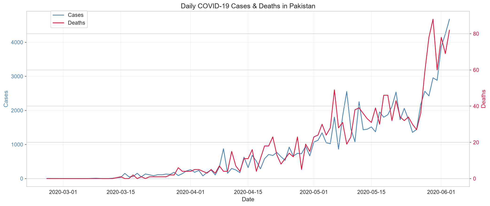
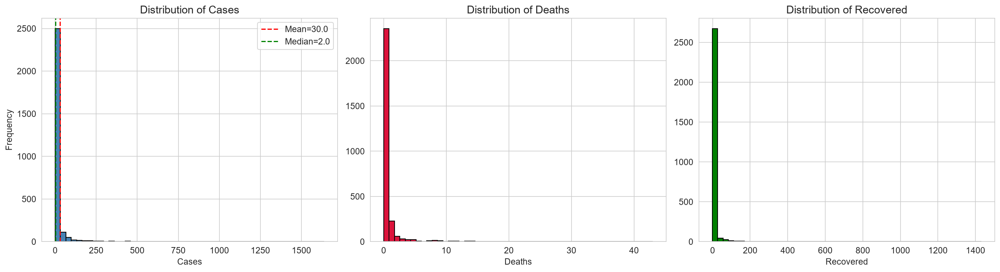
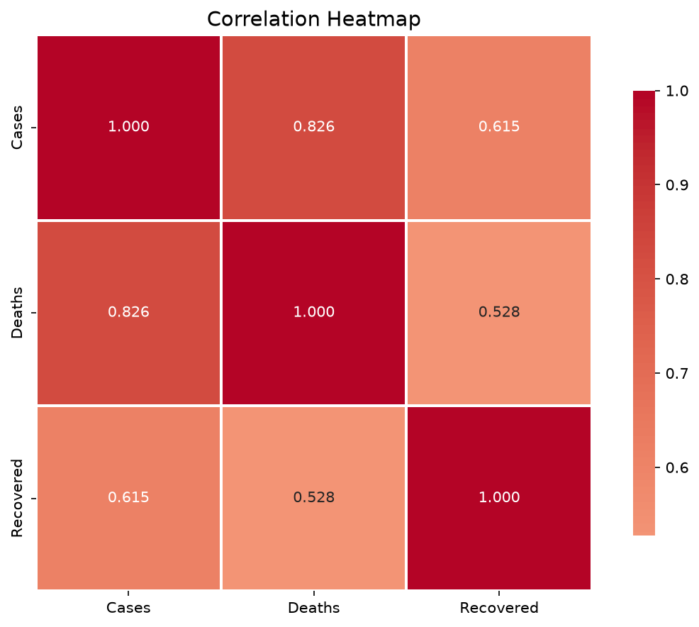
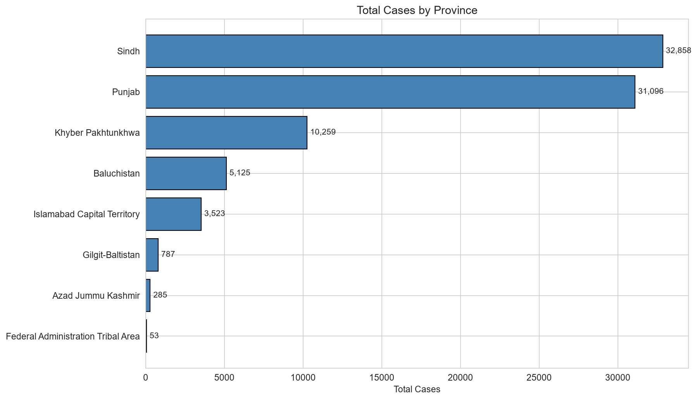
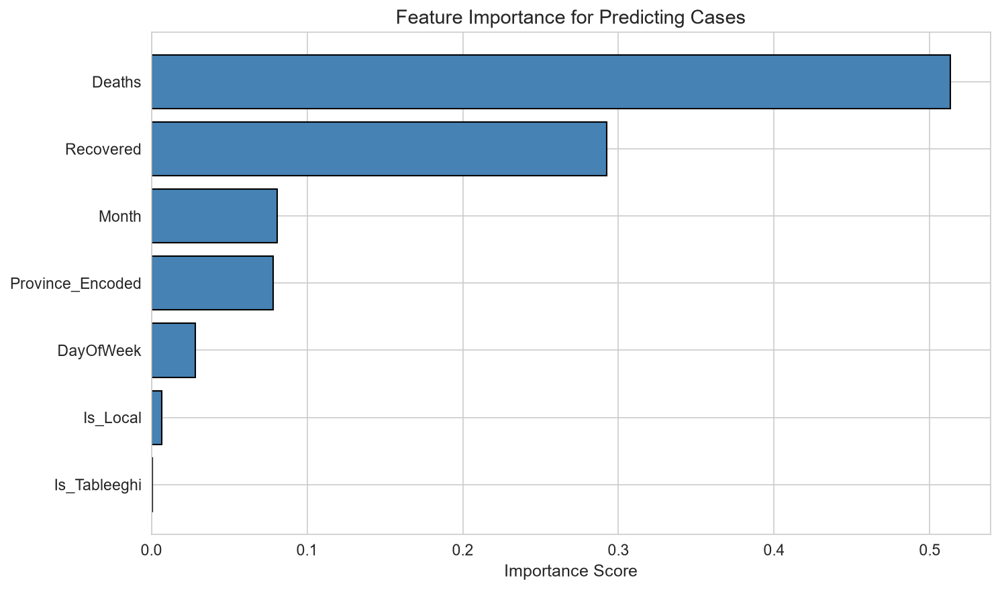
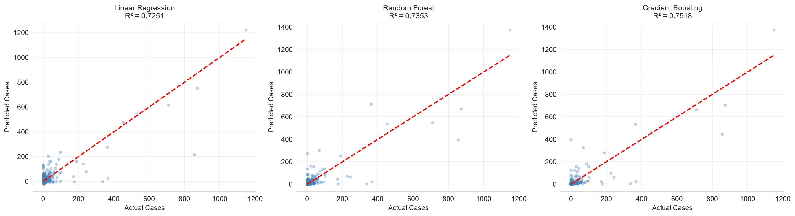
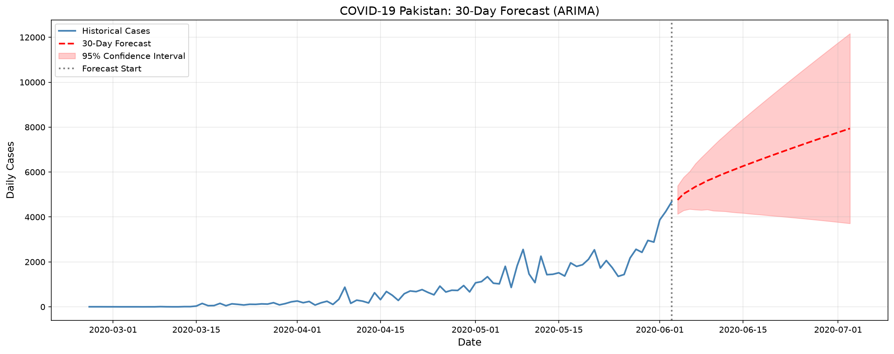

<div align="center">

# 🦠 COVID-19 Pakistan Analysis

### An end-to-end Data Science project combining exploratory analysis, machine learning, and time-series forecasting with an interactive Streamlit dashboard.

[](https://www.python.org/)
[](https://streamlit.io/)
[](https://scikit-learn.org/)
[](https://pandas.pydata.org/)
[](https://opensource.org/licenses/MIT)
[]()

</div>

---

## 📖 Table of Contents

- [Project Overview](#-project-overview)
- [Key Findings](#-key-findings)
- [Live Demo](#-live-demo)
- [Visualizations](#-visualizations)
- [Machine Learning Models](#-machine-learning-models)
- [ARIMA Time Series Forecasting](#-arima-time-series-forecasting)
- [Project Structure](#-project-structure)
- [Tech Stack](#-tech-stack)
- [Installation](#-installation)
- [Usage](#-usage)
- [Author](#-author)
- [License](#-license)

---

## 🎯 Project Overview

This project provides a **comprehensive analysis of COVID-19 data in Pakistan** from **February 26, 2020 to June 3, 2020**. It covers the entire data science pipeline: from raw data cleaning to machine learning models and time-series forecasting, culminating in an interactive web dashboard.

### ✨ Features

- 📊 **Exploratory Data Analysis** — Deep dive into cases, deaths, and recoveries
- 📈 **Statistical Analysis** — Mean, variance, standard deviation, correlation
- 🤖 **Machine Learning** — 3 regression models with hyperparameter tuning
- 📉 **Time-Series Forecasting** — ARIMA model for 30-day predictions
- 🎨 **Interactive Dashboard** — Streamlit web app with live filters
- 📁 **Professional Structure** — Clean, modular, and reproducible code

---

## 📊 Key Findings

| Metric | Value |
|:-------|------:|
| 📅 **Date Range** | Feb 26 – Jun 3, 2020 |
| 📋 **Total Records** | 2,798 |
| 🗺️ **Provinces Covered** | 8 |
| 🏙️ **Cities Covered** | 125 |
| 🦠 **Total Cases** | **83,986** |
| 💀 **Total Deaths** | **1,728** |
| 💚 **Total Recovered** | **24,754** |
| ⚠️ **Case Fatality Rate** | **2.06%** |
| ✅ **Recovery Rate** | **29.47%** |

### Descriptive Statistics (Cases)

| Statistic | Value |
|:----------|------:|
| Mean | 30.02 |
| Median | 2.00 |
| Variance | 16,605.33 |
| Std Deviation | 128.86 |
| Skewness | 7.36 |
| Kurtosis | 63.10 |
| Maximum | 1,639 |

> 📌 **Insight:** The data is heavily right-skewed (skewness = 7.36), indicating occasional massive spikes in daily cases — typical of pandemic data.

---

## 🌐 Live Demo

🚀 **Try the interactive dashboard here:**

👉 **[covid19-pakistan-analysis.streamlit.app](https://covid19-pakistan-analysis.streamlit.app)**

*Coming soon — deployment in progress*

The dashboard allows you to:

- 🎛️ Filter by **Province**, **Date Range**, and **Travel History**
- 📊 View **real-time KPIs** (Cases, Deaths, Recovered, Active)
- 📈 Interact with **dynamic charts** that update on every filter change
- 🤖 Get **ML predictions** for new scenarios
- 📉 See **30-day ARIMA forecasts** with confidence intervals

---

## 📸 Visualizations

### 1. Daily Trend Analysis


### 2. Distribution of Cases


### 3. Correlation Heatmap


### 4. Cases by Province


### 5. Feature Importance


### 6. Model Predictions


### 7. 30-Day ARIMA Forecast


> 📁 All 13 visualizations available in `outputs/figures/`

---

## 🤖 Machine Learning Models

Three regression models were trained to predict daily COVID-19 cases based on deaths, recoveries, travel history, and temporal features.

### Model Performance

| Rank | Model | R² Score | RMSE | MAE |
|:----:|:------|:--------:|:----:|:---:|
| 🥇 | **Gradient Boosting** | **0.7518** | 42.50 | 14.64 |
| 🥈 | **Random Forest** | 0.7353 | 43.89 | 13.73 |
| 🥉 | **Linear Regression** | 0.7251 | 44.72 | 18.65 |

### 🏆 Best Model: Gradient Boosting

- **R² Score:** 0.7518 → Model explains **75% of variance**
- **RMSE:** 42.50 → Average prediction error of ~42 cases
- **Features Used:** Deaths, Recovered, Travel History, Province, Month, Day of Week

---

## 📉 ARIMA Time Series Forecasting

### Model: ARIMA(7, 1, 1)

| Metric | Value |
|:-------|------:|
| **AIC** | 1423.38 |
| **BIC** | 1446.64 |
| **MAPE** | **23.43%** ✅ |
| **RMSE** | 859.78 |
| **MAE** | 585.10 |

### 30-Day Forecast Summary (Jun 4 – Jul 3, 2020)

| Metric | Value |
|:-------|------:|
| 📊 **Total Predicted Cases** | 196,422 |
| 📈 **Average Daily Cases** | 6,547 |
| 🔺 **Peak Predicted Day** | 7,939 |
| 🔻 **Minimum Predicted Day** | 4,760 |

> ⚠️ **Note:** Forecasts are trend indicators based on historical data. Real-world factors (lockdowns, policy changes, testing rates) can significantly affect actual outcomes.

---

## 📁 Project Structure

```text
covid19-pakistan-analysis/
│
├── app/
│   └── app.py                          # Streamlit dashboard
│
├── data/
│   ├── raw/
│   │   └── PK COVID-19-3jun.csv        # Original dataset
│   └── processed/
│       └── PK_COVID_19_cleaned.csv     # Cleaned dataset
│
├── models/
│   ├── covid_cases_model.pkl           # Trained Random Forest
│   ├── model_features.pkl              # Feature list
│   └── province_encoder.pkl            # Label encoder
│
├── notebooks/
│   └── COVID_19_analysis.ipynb         # Full analysis notebook
│
├── outputs/
│   └── figures/
│       ├── 01_histograms.png
│       ├── 02_boxplots.png
│       ├── 03_correlation_heatmap.png
│       ├── 04_timeseries.png
│       ├── 05_moving_average.png
│       ├── 06_province_bar.png
│       ├── 07_boxplot_province.png
│       ├── 08_feature_importance.png
│       ├── 09_actual_vs_predicted.png
│       ├── 10_residuals.png
│       ├── 11_timeseries_raw.png
│       ├── 12_forecast_arima.png
│       └── 13_arima_validation.png
│
├── .gitignore
├── README.md
└── requirements.txt
```

---

## 🛠️ Tech Stack
| Technology | Purpose |
|:-----------|:--------|
| 🐍 **Python 3.14** | Core programming language |
| 🐼 **Pandas** | Data manipulation |
| 🔢 **NumPy** | Numerical computing |
| 📊 **Matplotlib** | Base visualizations |
| 🎨 **Seaborn** | Statistical visualizations |
| 🤖 **scikit-learn** | Machine learning models |
| 📉 **statsmodels** | ARIMA forecasting |
| 🎨 **Streamlit** | Interactive dashboard |
| 🔬 **SciPy** | Statistical tests |
🚀 Installation
Prerequisites
Python 3.10 or higher

pip package manager

### Step 1: Clone the Repository

```bash
git clone https://github.com/Bilaldataorbit/covid19-pakistan-analysis.git
cd covid19-pakistan-analysis
```

### Step 2: Create Virtual Environment

```bash
python -m venv venv
```

**Windows:**
```bash
venv\Scripts\activate
```

**Mac/Linux:**
```bash
source venv/bin/activate
```

### Step 3: Install Dependencies

```bash
pip install -r requirements.txt
```
💻 Usage
### Option 1: Run the Streamlit Dashboard

```bash
streamlit run app/app.py
```

Browser will open at `http://localhost:8501`

### Option 2: Explore the Jupyter Notebook

```bash
jupyter notebook notebooks/COVID_19_analysis.ipynb
```

### Option 3: Use the Trained Model

```python
import pickle
import pandas as pd

with open('models/covid_cases_model.pkl', 'rb') as f:
    model = pickle.load(f)

input_data = pd.DataFrame({
    'Deaths': [5],
    'Recovered': [50],
    'Is_Local': [1],
    'Is_Tableeghi': [0],
    'Month': [6],
    'DayOfWeek': [2],
    'Province_Encoded': [7]
})

prediction = model.predict(input_data)
print(f"Predicted Cases: {prediction[0]:.0f}")
```
🎓 Skills Demonstrated
- ✅ **Data Wrangling** — Pandas, NumPy for cleaning 2,798 records
- ✅ **Exploratory Data Analysis** — Statistical summaries and visualizations
- ✅ **Feature Engineering** — Date features, binary flags, derived metrics
- ✅ **Machine Learning** — Regression, ensemble methods, hyperparameter tuning
- ✅ **Time Series** — Stationarity tests, ARIMA modeling, forecasting
- ✅ **Data Visualization** — Matplotlib, Seaborn for 13+ professional charts
- ✅ **Web Development** — Streamlit for interactive dashboards
- ✅ **Model Deployment** — Pickle serialization, GitHub versioning
- ✅ **Best Practices** — Virtual environments, modular structure, documentation

## 👨‍💻 Author

**Bilal Raza**

- 🐙 GitHub: [@Bilaldataorbit](https://github.com/Bilaldataorbit)
- 📧 Email: dataorbit.official@gmail.com

---

## 📜 License

This project is licensed under the **MIT License**.

---

## 🙏 Acknowledgments

- 📊 **Data Source:** Pakistan COVID-19 tracking data (Feb–Jun 2020)
- 🎨 **Inspiration:** Various data science portfolio projects
- 🤝 **Community:** Open-source contributors

<div align="center">
⭐ If you found this project helpful, please give it a star!
Made with ❤️ by [Bilal Raza](https://github.com/Bilaldataorbit)

</div>